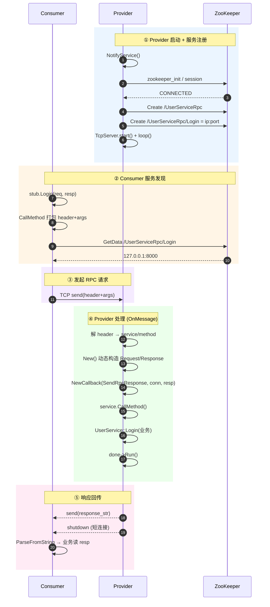
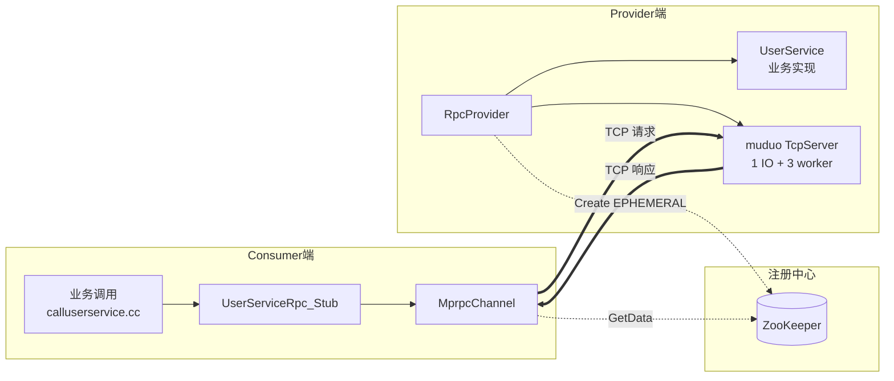
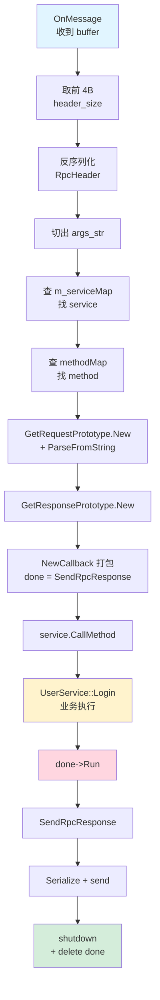

# mprpc 一次 RPC 调用的完整流程

本文以 `UserServiceRpc::Login` 为例，描述从 **Provider 启动** 到 **Consumer 调用并收到响应** 的全过程，参与方包括：
- **RPC 服务调用方**（Consumer，`example/caller/calluserservice.cc`）
- **RPC 服务提供方**（Provider，`example/callee/userservice.cc`）
- **ZooKeeper**（服务注册与发现中心）

## 1. 整体时序图



> 📌 **配色含义**：蓝=启动注册 / 橙=服务发现 / 紫=请求发送 / 绿=服务端处理 / 粉=响应回传

---

## 1.5 架构组件图



---

## 1.6 OnMessage 内部流水线



---

## 2. 关键类与职责

### 2.1 框架类

| 类 | 文件 | 职责 |
|---|---|---|
| `MprpcApplication` | `src/include/mprpcapplication.h` | 框架入口（单例），`Init()` 解析 `-i config.conf` 并加载到全局 `MprpcConfig` |
| `MprpcConfig` | `src/include/mprpcconfig.h` | `key=value` 配置解析（rpcserverip / rpcserverport / zookeeperip / zookeeperport） |
| `RpcProvider` | `src/include/rpcprovider.h` | 服务发布方：`NotifyService` 注册服务、`Run` 起 muduo + 注册 ZK |
| `MprpcChannel` | `src/include/mprpcchannel.h` | 客户端 Stub 的底层通道，实现 `CallMethod`：ZK 发现 + TCP 收发 |
| `MprpcController` | `src/include/mprpccontroller.h` | RPC 调用上下文，承载 `m_failed` / `m_errText` 错误信息 |
| `ZkClient` | `src/include/zookeeperutil.h` | ZooKeeper C 客户端封装：`Start` / `Create` / `GetData` |
| `Logger` + `LockQueue<T>` | `src/include/logger.h`, `lockqueue.h` | 异步日志：业务线程 `Push` 入队，后台线程 `Pop` 写文件 |

### 2.2 protobuf 生成的类（以 user.proto 为例）

| 类 | 角色 |
|---|---|
| `UserServiceRpc` | 服务端基类，业务 `UserService` 继承并重写 `Login` / `Register` |
| `UserServiceRpc_Stub` | 客户端代理，`stub.Login(...)` 内部调用 `channel_->CallMethod(...)` |
| `LoginRequest` / `LoginResponse` | 请求/响应消息，`SerializeToString` / `ParseFromString` 实现编解码 |

---

## 3. 关键方法调用链

### 3.1 Provider 启动期

```
main()
 └─ MprpcApplication::Init(argc, argv)              加载 test.conf
 └─ RpcProvider provider
 └─ provider.NotifyService(new UserService())
       └─ service->GetDescriptor()                  反射拿到服务/方法元信息
       └─ m_serviceMap["UserServiceRpc"] = {service*, methodMap}
 └─ provider.Run()
       ├─ muduo::TcpServer 创建 + setThreadNum(4)
       │     ├─ setConnectionCallback(OnConnection)
       │     └─ setMessageCallback(OnMessage)
       ├─ ZkClient zkCli; zkCli.Start()             连接 ZK，sem 同步
       ├─ 遍历 m_serviceMap 注册到 ZK
       │     ├─ Create("/UserServiceRpc")           永久节点（服务名）
       │     └─ Create("/UserServiceRpc/Login",
       │               "ip:port", ZOO_EPHEMERAL)    临时节点（实例地址）
       ├─ server.start()
       └─ m_eventLoop.loop()                         阻塞等待 IO 事件
```

### 3.2 Consumer 调用期

```
stub.Login(controller, request, response, nullptr)
 └─ MprpcChannel::CallMethod(method, controller, request, response, done)
       ├─ method->service()->name() / method->name()  取出 service/method 名字
       ├─ request->SerializeToString(&args_str)       序列化业务参数
       ├─ 构造 RpcHeader(service_name, method_name, args_size) 并序列化
       ├─ send_rpc_str = [4B header_size] + rpc_header_str + args_str
       │
       ├─ ZkClient zkCli; zkCli.Start()
       ├─ host_data = zkCli.GetData("/UserServiceRpc/Login")  →  "127.0.0.1:8000"
       │
       ├─ socket() / connect() / send(send_rpc_str)
       ├─ recv(recv_buf, 1024)
       └─ response->ParseFromString(response_str)     反序列化业务响应
```

### 3.3 Provider 处理期（核心：OnMessage）

```
RpcProvider::OnMessage(conn, buffer, ts)
 ├─ 1. recv_buffer = buffer->retrieveAllAsString()
 ├─ 2. 解出 header_size(4B) → RpcHeader → args_str
 ├─ 3. m_serviceMap 查 service / methodMap 查 method
 ├─ 4. request  = service->GetRequestPrototype(method).New()
 │     request->ParseFromString(args_str)
 ├─ 5. response = service->GetResponsePrototype(method).New()
 ├─ 6. done = NewCallback(this, &SendRpcResponse, conn, response)
 │     ↑ 用 protobuf::Closure 把 (conn, response) 提前绑死
 │
 ├─ 7. service->CallMethod(method, nullptr, request, response, done)
 │     └─ 派发到 UserService::Login(controller, request, response, done)
 │            ├─ 取 request->name() / pwd()
 │            ├─ 业务逻辑
 │            ├─ response->mutable_result()->set_errcode(0)
 │            ├─ response->set_success(...)
 │            └─ done->Run()  ★ 触发回调
 │                   └─ RpcProvider::SendRpcResponse(conn, response)
 │                          ├─ response->SerializeToString(&response_str)
 │                          ├─ conn->send(response_str)
 │                          └─ conn->shutdown()       短连接，主动断开
 │
 └─ Closure 内部 delete this 自销毁
```

---

## 4. 数据格式约定

### 4.1 网络字节流布局（Consumer → Provider）

```
+----------------+--------------------------+----------------------+
| header_size 4B |       RpcHeader          |       args_str       |
| (uint32_t原始) | service_name/method_name | 业务 Request 序列化  |
|                | /args_size 序列化结果    |                      |
+----------------+--------------------------+----------------------+
```

读取顺序：先取前 4 字节得到 `header_size`，再读 `header_size` 长度反序列化出 `RpcHeader`，根据其中的 `args_size` 切出业务参数。

### 4.2 ZooKeeper 节点结构

```
/
└── UserServiceRpc                永久节点（服务名）
    ├── Login    → "127.0.0.1:8000"   临时节点（实例 ip:port）
    └── Register → "127.0.0.1:8000"   临时节点
```

- **永久节点**：服务名，不会因 provider 下线而消失
- **临时节点**：method 节点带实例地址，provider 进程退出后 ZK session 失效，节点自动删除，consumer 立即感知不到这台机器
- **session timeout 30s**：ZK C client 的 IO 线程每 `1/3 * 30s = 10s` 发送一次心跳

---

## 5. 线程模型

### 5.1 Provider 端
- **主线程**：`m_eventLoop.loop()` 等待 IO（muduo 的 baseLoop）
- **3 个 worker 线程**：muduo `setThreadNum(4)` 中的 4 = 1 主 IO + 3 worker。`OnMessage` 在 worker 线程被调用，业务方法 `UserService::Login` 也跑在 worker 线程
- **ZK IO 线程 + Completion 线程**：由 `zookeeper_init` 自动创建，watcher 回调在 Completion 线程执行

### 5.2 Consumer 端
当前实现是同步阻塞：`CallMethod` 在调用线程内同步完成 `connect → send → recv → parse`，没有额外线程。

---

## 6. Closure 回调机制要点

`google::protobuf::Closure` 是 protobuf 提供的**无参回调对象**抽象。

```cpp
// 创建（在 OnMessage 中）
done = NewCallback(this, &RpcProvider::SendRpcResponse, conn, response);
//                                                       ↑↑↑↑  ↑↑↑↑↑↑↑↑
//                                                       2 个参数提前绑死

// 触发（在业务方法 UserService::Login 中）
done->Run();
//   ↑ 内部展开：this->SendRpcResponse(conn, response); delete this;
```

**为什么需要 Closure？**
- 业务代码只依赖 `Closure*` 接口，不需要知道框架是 muduo 还是别的
- 业务可异步：`done->Run()` 不必在 `CallMethod` 里立即调用，可以攒到 IO/DB 完成后再触发
- 框架统一回收：`Closure::Run` 内部 `delete this`，业务无需关心生命周期

**限制**：protobuf 的 `NewCallback` 最多支持 2 个绑定参数（`MethodClosure0/1/2`），更多参数需要用结构体打包。

---

## 7. 关键踩坑点（开发期实测）

| 问题 | 现象 | 原因 / 修复 |
|---|---|---|
| `send_rpc_str.insert(0, ...)` 越界 | `std::out_of_range: __pos (which is 4) > this->size() (which is 1)` | 空 string 不能 insert(0,...,4)；改用 `append((char*)&header_size, 4)` |
| `response_str` 被 `\0` 截断 | recv 收到 4 字节但 response_str.size()=1，ParseFromString 失败 | `string(recv_buf, 0, n)` 错误地走 string 拷贝构造遇 `\0` 截断；改用 `string(recv_buf, recv_size)` |
| `ZkClient::Start` 用栈 sem | watcher 二次触发时访问已销毁的 sem，崩溃 `futex facility returned an unexpected error code` | sem_wait 后 `zoo_set_context(zh, nullptr) + sem_destroy`，watcher 内部判空 |
| ZK 客户端 3.4.10 与新版 server 不兼容 | `errno=112(Host is down)` / `ZCONNECTIONLOSS(-4)` | client 与 server 版本必须匹配 |
